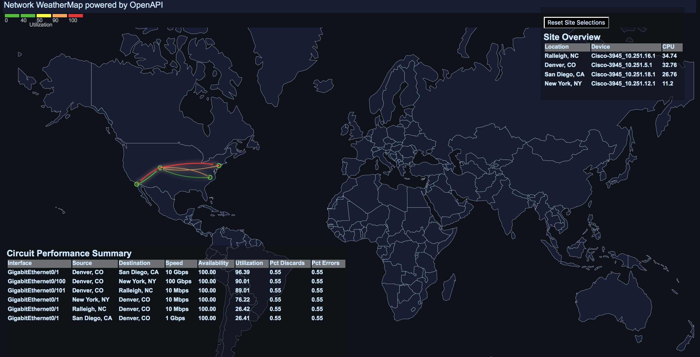

# Geo Network Weathermap
Geo map view of simple Network topology focusing on site-to-site WAN connectivity

## Installation Instructions:
1. Deploy the App using the CAPC App Installer
2. Add an App View in the Dashboard or Page builder and select the Geo Weathermap (D3)
3. Modify parameters as documented below

### Requirements
1. Leverages Device Longitude, Latitude, and Location Description attributes to determine where to place each location on the map
2. Leverages a custom attribute "ConnectsTo" to provide the connectivity between the locations
3. Uses Interface-Conections and DeviceGeoTag Apps to easily define locations of devices and connections using an App within the Inteface and Device context pages
4. Consult OpenAPI-WeatherMap_Case_Study.pdf for more information on pre-requisites

### Key URL parameters:

<table>
    <tr>
        <td>Parameter</td>
        <td>Description</td>
        <td>Values</td>
    </tr>
    <tr>
        <td>id</td>
        <td>ID of group passed from CAPC Dashboard</td>
        <td>{itemIdDA}</td>
    </tr>    
    <tr>
        <td>startTime</td>
        <td>Data range start time in EPOC seconds</td>
        <td>{timeStartUTC}</td>
    </tr>
    <tr>
    	<td>endTime</td>
    	<td>Data range end time in EPOC seconds</td>
        <td>{timeEndUTC}</td>
    </tr>
    <tr>
    	<td>scope</td>
    	<td>Specify to focus map on particular geo.</td>
        <td>usa: United States  europe: Europe  apj: Asia Pacific </td>
    </tr>
    <tr>
    	<td>connect</td>
    	<td>Specify whether connections should be full or half. Allows for cleaner views when there are a lot of connections</td>
        <td>full: full lines for each connection   half: Lines meet in the middle with an arrow</td>
    </tr>
    <tr>
    	<td>glow</td>
    	<td>Wehther to provide a glow effect to the connections</td>
        <td>true: show glow effect on connection hover.  false: do not show glow effect</td>
</table>

===================================================================================

License (refer to license.txt in folder for 3rd party license details)

Copyright (c) 2016 CA Technologies
 
The MIT License

Permission is hereby granted, free of charge, to any person obtaining a copy of this software and associated documentation files (the "Software"), to deal in the Software without restriction, including without limitation the rights to use, copy, modify, merge, publish, distribute, sublicense, and/or sell copies of the Software, and to permit persons to whom the Software is furnished to do so, subject to the following conditions:
 
The above copyright notice and this permission notice shall be included in all copies or substantial portions of the Software.
 
THE SOFTWARE IS PROVIDED "AS IS", WITHOUT WARRANTY OF ANY KIND, EXPRESS OR
IMPLIED, INCLUDING BUT NOT LIMITED TO THE WARRANTIES OF MERCHANTABILITY,
FITNESS FOR A PARTICULAR PURPOSE AND NONINFRINGEMENT. IN NO EVENT SHALL THE
AUTHORS OR COPYRIGHT HOLDERS BE LIABLE FOR ANY CLAIM, DAMAGES OR OTHER
LIABILITY, WHETHER IN AN ACTION OF CONTRACT, TORT OR OTHERWISE, ARISING FROM,
OUT OF OR IN CONNECTION WITH THE SOFTWARE OR THE USE OR OTHER DEALINGS IN
THE SOFTWARE.

===================================================================================

